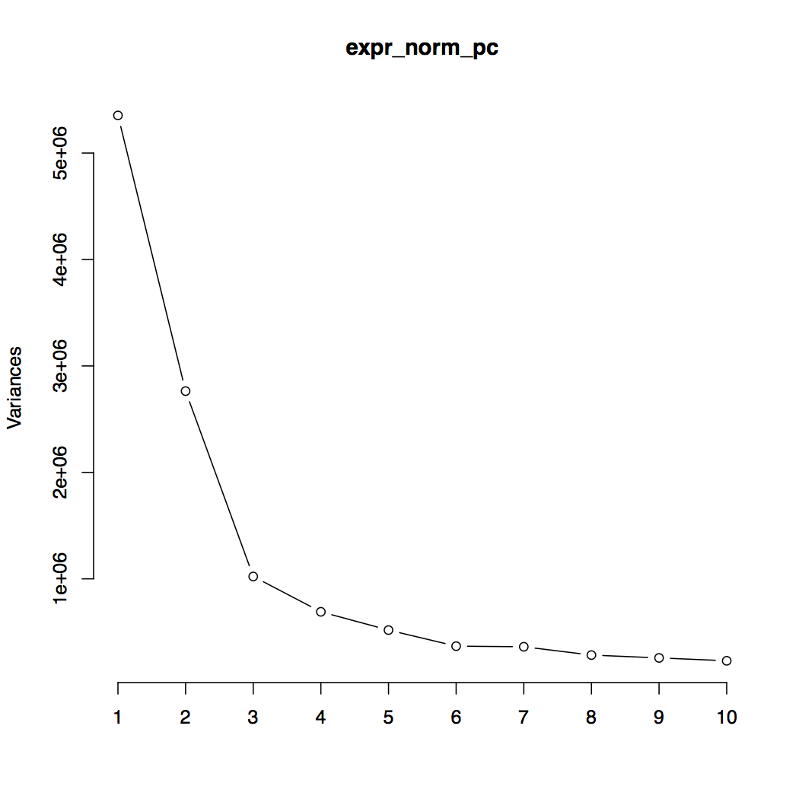

gfm: true

class: center, middle

# 1000 Genomes SV eQTL Analysis Update

Andrew Quitadamo
11/20/2014
---

#Previously...

* Results from *cis-* and *trans-* eQTL analysis  

--

* 100,000+ *trans-* results, even when Bonforroni corrected

--

* How do we limit our results, and reduce potential false positives?

---

#Principal components analysis

* We used PCA to look for and correct population stratification in both expression and genotype data.

--

```R
expr_norm_pc<-prcomp(expr_norm_cp-rowMeans(expr_norm_cp))
pdf('bitseq_norm_screeplot.pdf')
screeplot(expr_norm_pc)
dev.off()
```

---

#Genotype Screeplot


---

#Expression Screeplot



---

#PCA Correction

* Used the rotation of a PC as a covariate
```R
expr_norm_pc$rotation[,1]
```
--

* Chose to correct first 3 genotype PCs, and 6 expression PCs

--

* Still too many trans-results (18,855 with Bonferroni correction of 0.01)

---

# Permutation Analysis

* Permuted gene expression 1000 times, recalculated PCA, and ran matrix eQTL

--

* Looked at 1,851,623 potential *trans-* SV-gene pairs

--

* 523,356 had less than 10 permuted cases (p-value 0.01)

--

* 1409 had less than 1 permuted case (p-value 0.001)

---

#Permutation Analysis (cont.)

* Still too many results, currently running 10,000 permutations

--

* *trans-* results are ~1.5 TB
