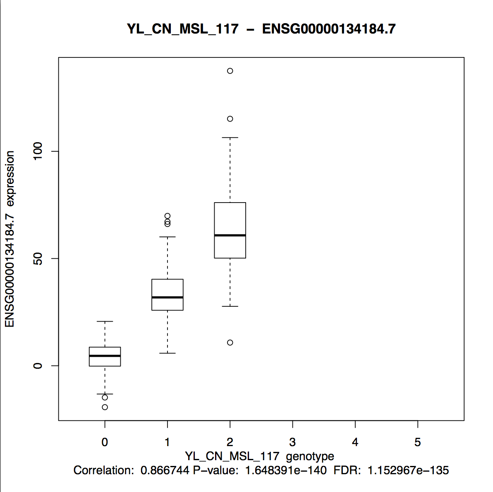
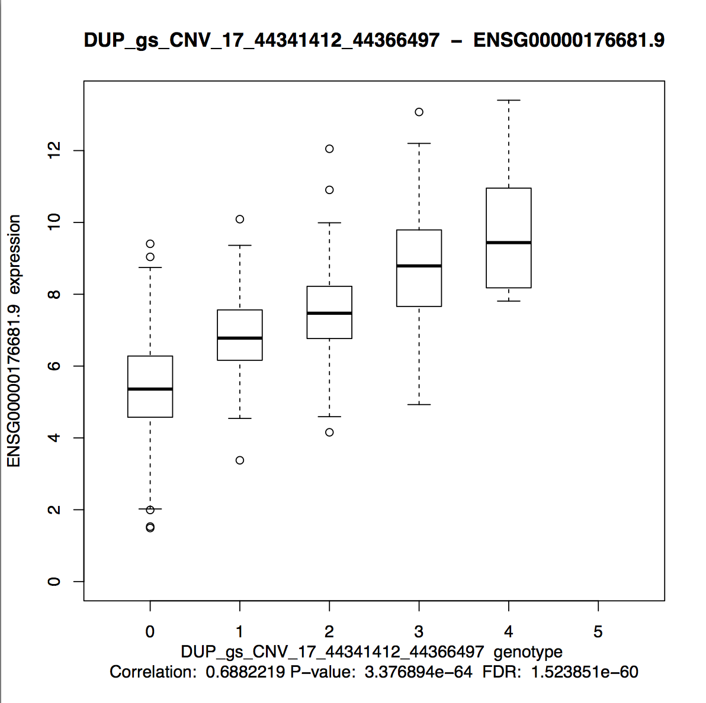

gfm: true

class: center, middle

# 1000 Genomes SV eQTL Analysis Update

Andrew Quitadamo
9/5/2014
---

#SV Data

* 2535 individuals

--

* 67117 SVs in initial file

--

|SV Type | Number|
|----------|----------|
|NUMTS 		|	165|
|ALU	 	| 12492|
|DEL		| 41084|
|DUP		| 8786|
|SVA		| 822|
|INV		|858|
|LINE 	|	2910|

---

#Expression Data

* GEUVADIS Study

--

* RNASeq of 465 individuals from the CEPH (CEU), Finns (FIN), British (GBR), Toscani (TSI) and Yoruba (YRI) populations

--

* Currently just using the gene expression, adding exons

--

* 446 samples overlap between the 1000 Genomes SVs and GEUVADIS

---

#Workflow

* Get data from common samples

--

* Parse genotypes

--

* Filter data on 5% MAF

--

* Run Matrix eQTL 

---

# Preliminary Results

* 4113 eQTLs

--

* 1866 eQTLs FDR < 0.1

--

* 998 unique SVs

--

* 1162 unique genes

--

Most common SVs

Name | Number
-----|-----
DEL_pindel_45694|17
DEL_pindel_45690|15
BI_GS_DEL1_B3_P2555_15|15
SVA_umary_SVA_706|14
DUP_gs_CNV_17_44341412_44366497|14
---

#Preliminary Results (Cont.)

Most common Genes

Name|Number
------|------
ZNF280B|21
PRAMEL|16
HLA-DQA1|16
HLA-DQB1|15
HLA-DQA1|15

--

* Will have to map to gene name and redo frequency

---

#SV Frequency

| SV Type    | Initial Number | Number in eQTLs |
|----------|:----------:|:-------------:|
|NUMTS 		 |   165| 21
|ALU        | 12492| 2905
|DEL        | 41084| 4607
|DUP        | 8786| 264
|SVA        | 822| 189
|INV        |858| 92
|LINE   |   2910| 358

---
#Correlation Box Plots

---
#Correlation Box Plots (Cont.)

---
#Correlation Box Plots (Cont.)

---
#Next Steps

* Add exon data

--

* Add BitSeq data

--

* Use combined SV and SNP data

--

* Look for SV/gene overlaps

--

* Phased genotypes

