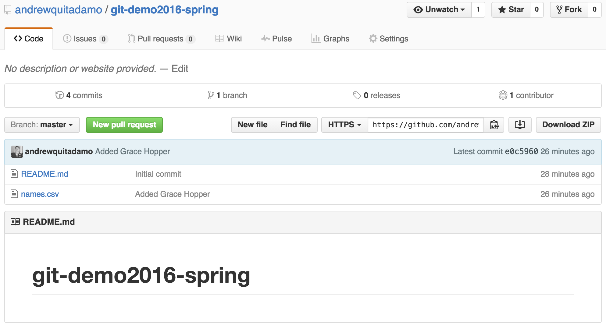

class: center, middle

# Gitting Started With Version Control

Andrew Quitadamo  
Programming II

---

# Overview

*   What is Git?  

--

*   Why Should I Care?  

--

*   Using Git and Github  

---

# What is Git?

* Git is a distributed version control system

--

* Version control systems allow you to track and store changes to files  

--

* You can view the changes you've made in a file's history, and revert them

--

* Distributed version control systems don't rely on a single central repository

--

* This means you can use git anywhere, even if you don't have internet access
---

# Why Should I Care?

<blockquote class="twitter-tweet" lang="en"><p><a href="https://twitter.com/mtholder">@mtholder</a> motivating git: You mostly collaborate with yourself, and me-from-two-months-ago never responds to email. <a href="https://twitter.com/swcarpentry">@swcarpentry</a></p>&mdash; Karen Cranston (@kcranstn) <a href="https://twitter.com/kcranstn/status/370914072511791104">August 23, 2013</a></blockquote>
<script async src="//platform.twitter.com/widgets.js" charset="utf-8"></script>

---

# Where to get Git

*  [Git Download](http://git-scm.com/downloads)

*  [Git GUI Clients](http://git-scm.com/downloads/guis)

---

# What is Github

*  Github is a web based repository host for Git  

--

*  Github adds a web-based interface for Git  

--

*  It adds functionality like forking, and pull requests which contribute to a collaborative model  

--

*  You can sign up for a Github account [here](https://github.com/)
---

# Creating a new git repository

* You can either create a new repo from the command line or on Github

--

* Command Line

    Inside the folder you want to create the repo for type: 
    ```
    git init
    ```
--

* Github

    

---

# Creating a new git repository (cont.)


---

# Forking a repository

* Forking allows you to take someone else's repository and make it your own.

--

* Go to https://github.com/andrewquitadamo/git_demo



---

# Cloning a repository

* To download a repo from Github onto your local computer use git clone.

    ```
    git clone https://github.com/andrewquitadamo/git_demo.git
    ```
--

* This will create a new folder with the repo's name in your current directory.

---

# Tracking changes

* First let's make some changes to the file in the git_demo repo. Open up your favorite text editor and add your name.

--
* You can check the files in your repo by typing:

    ```
    git status
    ```

--

* You should see something like this:

    ```
    On branch master
    Your branch is up-to-date with 'origin/master'.

    Changes not staged for commit:
      (use "git add <file>..." to update what will be committed)
      (use "git checkout -- <file>..." to discard changes in working directory)

            modified:   names.csv

    no changes added to commit (use "git add" and/or "git commit -a")
    ```
---

# Tracking changes (cont.)

* You can check how the file has been changed by typing:

    ```
    git diff names.csv
    ```
--

* You should see something like:
    ```
    diff --git a/names.csv b/names.csv
    index 0dc5ee6..81b7767 100644
    --- a/names.csv
    +++ b/names.csv
    @@ -1,2 +1,3 @@
     FirstName,LastName
     Andrew,Quitadamo
    +Richard,Feynman    
    ```

---

# Adding changes

* There is a two step process to adding changes to a repo.

    1) Add the files you want to commit
    ```
    git add names.csv
    ```

    2) Commit the changes
    ```
    git commit
    ```

---

# Documenting changes

* Commit messages are used to indicate what you've changed. 

--

* If you just use git commit a text editor will appear and you can type add your commit message. You can change your default editor by using the git config command.
    ```
    git config --global core.editor vim
    ```

--

* You can also use the -m flag to add a commit message in the command line without opening an editor.
    ```
    git commit -m'Added Richard Feynman'
    ```
---

# Committing for the first time

* The first time you commit to git it may ask you to set your name and email. Don't panic.

    ```
    git config --global user.name "Andrew Quitadamo"
    git config --global user.email aquitada@uncc.edu"
    ```
---

# Pushing Changes to Github

* To put the changes you've made onto Github use the push command
    ```
    git push
    ```

--

* You will be asked for your Github username and password. You should see output like:
    ```
    Username for 'https://github.com': andrewquitadamo
    Password for 'https://andrewquitadamo@github.com': 
    Counting objects: 5, done.
    Delta compression using up to 2 threads.
    Compressing objects: 100% (3/3), done.
    Writing objects: 100% (3/3), 341 bytes | 0 bytes/s, done.
    Total 3 (delta 0), reused 0 (delta 0)
    To https://github.com/andrewquitadamo/git_demo.git
       b38b2e4..e7ccb69  master -> master
    ```

--

* If you don't want to type in your password everytime you can set up a [SSH key](https://help.github.com/articles/generating-ssh-keys/).

--

* If you want to push to Github from one of the Viper or Cobra, you will need to set up a SSH key.
---

# Editing on Github

* You can also make changes directly on Github, although you should probably only use it for minor changes.

--

* You can only do this to repos that you have access to.
--

* Open up your personal git_demo repository on Github, and add a new name to it.


---

# Editing on Github (cont.)


---

# Pulling changes

* When there are changes that have occured on Github, but aren't in your local repository you need to get them.

--

* You can use the git pull command for this:
    ```
    git pull
    ```

--
* You should see something like this:
   ```
    remote: Counting objects: 3, done.
    remote: Compressing objects: 100% (3/3), done.
    remote: Total 3 (delta 0), reused 0 (delta 0), pack-reused 0
    Unpacking objects: 100% (3/3), done.
    From https://github.com/andrewquitadamo/git_demo
      e7ccb69..30c1a19  master     -> origin/master
    Updating e7ccb69..30c1a19
    Fast-forward
     names.csv | 1 +
     1 file changed, 1 insertion(+)
    ```

---

# Checking the History

* You can use the command line or Github to view the commits.

--

* You can use git log on the command line and the output should look like:
    ```
    commit 30c1a193663a1a0cc7ba4fdeb8ad2438a417d592
    Author: Andrew Quitadamo <andrew.quitadamo@gmail.com>
    Date:   Thu Mar 12 12:20:02 2015 -0400

        Added Grace Hopper

    commit e7ccb69b1caba36c2a8636fb5929aacb66c61c1d
    Author: Andrew Quitadamo <andrew.quitadamo@gmail.com>
    Date:   Thu Mar 12 09:15:57 2015 -0400

        Added Richard Feynman

    commit b38b2e445d1fcafe57470b85ff2fe2c2276d5ee5
    Author: Andrew Quitadamo <andrew.quitadamo@gmail.com>
    Date:   Wed Mar 11 17:46:36 2015 -0400

        Added names.csv

    commit 0b099e0971b69e393602b8109dd2f606f6b6afd3
    Author: Andrew Quitadamo <andrew.quitadamo@gmail.com>
    Date:   Wed Mar 11 17:45:28 2015 -0400

        Initial commit
    ```

---

# Checking the History (cont.)

* You can also view the commits on Github.

--


---

# Checking the History (cont.)


---
# Branches

* Branches are a way of separate and isolate changes. This allows multiple people to work on different features or ideas on the same codebase without them messing each other's code up.

--

* Branches can be created on the command line, or on Github.

--

* The master branch is the default branch.

--

*  To create a branch:  
```
git checkout -b <new_branch>
```

--

*  Switch back to master:
```
git checkout master
```
---

#Branches (cont.)


---
# Collaborating on Github

There are a few different ways that you can use Github to aid in collaboration

--

1) A shared repository where everyone has access, and commits to the master branch. This is what we've been doing in our lab.

--

2) A shared repository where everyone has access, but commits are done on a feature branch, which are merged into the master branch.

--

3) Repositories are forked to an individuals account, commits are made, and pull requests are used to add new features.

---

# Pull Requests

* Pull requests are how you can merge changes together, either from different branches, or from different repositories.


--


---

# Pull Request Practice

* Go to your git_demo repository on Github, and issue a pull request back to my original repo.

---

# Things that make Github worth using

*  [Issues tracking and Milestones](https://guides.github.com/features/issues/)

--

*  [Code as citable objects](https://guides.github.com/activities/citable-code/)

--

*  [Pull Requests](https://help.github.com/articles/using-pull-requests)

--

*  Its a place to publish our code that people can easily access. 

--

*  [Github pages](https://pages.github.com/)

--

*  The collaboration model

---

name: Resources

# Resources

*  [Git - The Simple Guide](http://rogerdudler.github.io/git-guide/)

*  [Git Cheat Sheet](http://overapi.com/git/)

*  [Git Cheat Sheet from Github](https://github.com/github/training-materials/blob/master/downloads/github-git-cheat-sheet.pdf?raw=true)

*  [Pro Git](http://git-scm.com/book)

*  [Software Carpentry Git & Github Lesson](http://software-carpentry.org/v5/novice/git/index.html)

*  [Collaboration on Github](https://help.github.com/articles/using-pull-requests)

*  [Github Flow](https://guides.github.com/introduction/flow/index.html)

*  [Github Guides](https://guides.github.com/)

*  [Git Screwup Solutions](http://41j.com/blog/2015/02/common-git-screwupsquestions-solutions/)

*  [Git Flight Rules](https://github.com/k88hudson/git-flight-rules)
