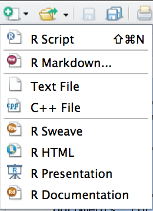
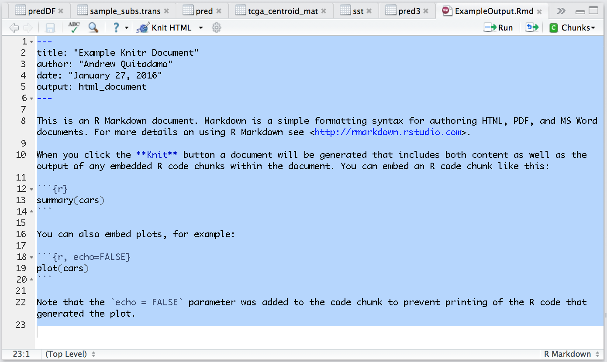
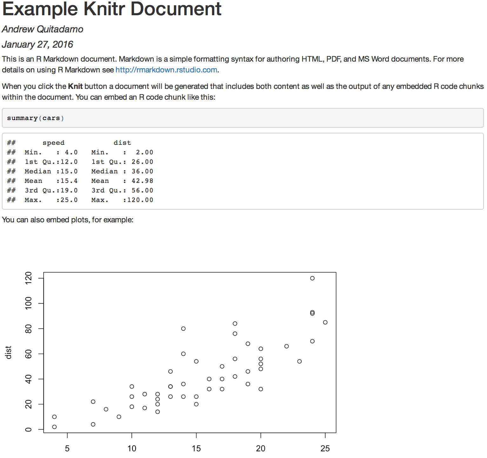

class: center, middle

# IPython Notebook and Tools for Reproducible Research

Andrew Quitadamo  
Programming II

---

# Overview

* Reproducible Research and Why it Matters

--

* The Anil Potti Saga

--

* IPython Notebooks

--

* Makefiles

--

* RMarkdown and Knittr

---

# Download Anaconda

* Go to [https://www.continuum.io/downloads](https://www.continuum.io/downloads)

* Download Anaconda for OS X

* Follow the install instructions

---

# What is Reproducible Research?

Reproducible research is the idea that data analyses, and more generally, scientific claims, are published with their data and software code so that others may verify the findings and build upon them. [1]

.footnote[[1][https://www.coursera.org/learn/reproducible-research](https://www.coursera.org/learn/reproducible-research)]

---

# Why is reproducibility important?

* "[Reproducibility](http://science.sciencemag.org/content/334/6060/1226) [Crisis](http://www.nature.com/news/reproducibility-1.17552)"

--

* 47/53 "landmark" cancer studies couldn't be replicated [1]

--

* A 2014 paper reported only 25% reproducibility of CS papers in their study [2]

.footnote[[1](http://www.nature.com/nature/journal/v483/n7391/full/483531a.html)] 
.footnote[[2](http://reproducibility.cs.arizona.edu/v1/tr.provide)]

---

# Why is reproducibility important?

* Research that isn't reproducible creates waste (money, time, effort)

--

* It can even affect patients

---

# The Anil Potti Saga

* In 2006 [Genomic signatures to guide the use of chemotherapeutics](http://www.nature.com/nm/journal/v12/n11/full/nm1491.html) was published in Nature Medicine

--

* The group at Duke produced great results predicting chemosensitivity based on gene expression profiles

--

* Bioinformaticians at MD Anderson became interested in these results and attempted to use them

--

* When they followed the procedure in the paper, they didn't get similar results

--

* In fact their results looked totally different

---

# The Anil Potti Saga (cont.)

* Forensic Bioinformatics time

--

* Attempt to recreate gene expression heatmaps for 7 chemotherapy drugs

--

* Compared list of genes and found an off-by-one error

--

* Bioinformaticians at MD Anderson ended up writing the documentation for the Duke software

--

* They replicated the off-by-one error by including a header in an input file

--

* They manage to match 6 of the 7 Heatmaps match, but only 3 of the 7 gene lists 

--

* The list of sensitive samples and resistant samples were flipped in the Nat. Med paper

--

* Keith Baggerly and Kevin Coombes wrote a letter Nat. Med. and they published their code, which was reproducible

---

# The Anil Potti Saga (cont.)

* The original authors responded saying Baggerly and Coombes are wrong

--

* Data published on the original authors web page had 144 samples in training/test data

--

* Baggerly and Coombes found only 84 unique samples, meaning samples were duplicated

--

* One sample was labeled resistant 3 times, and sensitive once

--

* The original authors redid their analysis with 95 "unique" samples

--

* They also took down the data from their website

--

* Of the 95 samples 15 were duplicated, 6 were labeled both as resistant and sensitive

---

# The Anil Potti Saga (cont.)

* The Duke group published other papers, including one in the [Journal of Clinical Oncology](http://jco.ascopubs.org/content/25/28/4350.full.provide+html)

--

* ERCC1, ERCC4 and DNA repair genes were found to be important

--

* ERCC1 and FANCM (DNA repair) aren't measured on the microarray the authors used

--

* More papers using the same technique followed

---

# The Anil Potti Saga (cont.)

* Clinical trials were started using the published gene signatures. 

--

* Including the gene signatures that used flipped sensitive/resistant labels.

--

* People were literally receiving drugs that would not work

--

* Baggerly and Coombes publish a [paper](https://projecteuclid.org/euclid.aoas/1267453942) in The Annals of Applied Statistics addressing all the problems

--

* Duke suspends clinical trials, opens investigation

--

* Duke concludes their investigation and restarts the clinical trials

--

* Original authors published more data

--

* Every single sample was either mislabeled, or not in the data set they said they used

---

# The Anil Potti Saga (cont.)

* A FOIA request was used to get the Duke report

--

* The investigation couldn't replicate the studies as published 

--

* NCI removes funding from one clinical trial

--

* However Duke continues with its three clinical trials

--

* It comes to light that Anil Potti claimed on his CV that he was a Rhodes Scholar

--

* He wasn't

--


* 33 Biostatisticians send a letter to the NCI, Duke, ORI, DoD and to the press

--

* Duke suspends the trials

--

* Covered in [NYT](http://www.nytimes.com/2011/07/08/health/research/08genes.html), [NPR](http://www.npr.org/sections/health-shots/2010/07/19/128630549/scientists-question-cancer-gene-trials-at-duke-university) and elsewhere

---

# The Moral of the Story

* This was a particularly bad combination of mistakes

--

* These mistakes are easy to make in bioinformatics research 

--

* Simple mistakes are simple to fix. If you notice them. Documentation is important.

--

* Because of this all reports at MD Anderson are now 100% reproducible (written in Sweave).

[Keith Baggerly's Talk](https://www.youtube.com/watch?v=7gYIs7uYbMo)

---

# What can we do?

* Provide code

--

* Document the code

--

* Test the code

--

* Version control the code

--

* Provide data

--

* Be skeptical of results. Especially the good ones.

---

# Reproducible Research Resources

* [How to Avoid Having to Retract Your Genomics Analysis](https://thewinnower.com/papers/avoid-having-to-retract-your-genomics-analysis)

* [Myths of Computational Reproducibility](http://ivory.idyll.org/blog/2014-myths-of-computational-reproducibility.html)

* [Ten Simple Rules for Reproducible Computational Research](http://journals.plos.org/ploscompbiol/article?id=10.1371/journal.pcbi.1003285)

* [Reproducible Research is Still a Challange](https://ropensci.org/blog/2014/06/09/reproducibility/)

* [Best Practices for Scientific Computing](Best Practices for Scientific Computing)

* [Tools and Techniques for Computational Reproducibility](http://biorxiv.org/content/early/2015/07/17/022707)

* [Five selfish reasons to work reproducibly](http://www.genomebiology.com/2015/16/1/274)

---

# IPython Notebook

* IPython Notebooks provide a way to combine code, texts and plots.

--

* Similar to old-school lab notebooks, where results and methods are together. Somebody could look at your lab notebook and reproduce your analysis (in theory). 

--

* Works in your browser, similar to the interactive Python shell on the command line.

---
# Using IPython Notebook

```
ipython notebook
```

---

# Version 3.0.0

* IPython Notebooks aren't just for Python anymore. While earlier versions did have the ability to use different kernals, Version 3.0.0 makes using them alot easier. 

--

* R, Julia, Perl, Bash, Spark, Haskell, Clojure, Go, Scala and many others.

---

# NBViewer

* Provides a place to display and share IPython Notebooks with others

--

* [Paper in Nature Genetics](https://github.com/theandygross/TCGA/tree/master/Analysis_Notebooks#guide-to-running)

--

* IPython Notebooks and NBViewer can be used to help create reproducible research.

--

* Plus its really cool.

---

# IPython Notebook Resources

* [NBViewer](http://nbviewer.jupyter.org/)

* [Interesting IPython Notebooks](https://github.com/ipython/ipython/wiki/A-gallery-of-interesting-IPython-Notebooks)

* [Bioinformatics with Python Cookbook](https://github.com/tiagoantao/bioinf-python)

* [Ben Langmead's Computational Genomics Class](https://github.com/BenLangmead/comp-genomics-class)

* [An Introduction to Applied Bioinformatics](http://readiab.org/)

---

# Makefiles

* GNU Make allows you to automatically execute rules, and specify dependencies for targets 

--

* A simple Makefile looks like:

```
targetfile: dependancyfile
	rule_to_create_targetfile
```

--

Here is an actual example from one of our projects:  

```
data/Homo_sapiens.GRCh37.75.gtf:
	wget -P ./data ftp://ftp.ensembl.org/pub/grch37/release-81/\
			gtf/homo_sapiens/Homo_sapiens.GRCh37.75.gtf.gz
	gunzip data/Homo_sapiens.GRCh37.75.gtf.gz

data/gene_positions: data/Homo_sapiens.GRCh37.75.gtf
	python code/extract_gene_position.py data/Homo_sapiens.GRCh37.75.gtf data/gene_positions
```

---

# Why Make

* Allows you to specify dependancies

--

* Unlike a shell script, Make only reruns rules when necessary

--

* You can use Make with any language

--

* Make is already installed on Mac OSX, Linux and Unix systems

---

# Make Resources

* [Karl Broman's Minimal Make Tutorial](http://kbroman.org/minimal_make/)

* [Why Use Make](http://bost.ocks.org/mike/make/)

* [Make for Reproducible Data Analysis](http://zmjones.com/make/)

---

# Knitr and RMarkdown

* Knitr can be used to combine text and R code to produce dynamic reports

--

* The R code is embedded in an RMarkdown document, and can be rerun by anyone

---

# How to Create a RMarkdown Document



---

# Knitr Example

```
---
title: "Example Knitr Document"
author: "Andrew Quitadamo"
date: "January 27, 2016"
output: html_document
---

This is an R Markdown document. 
Markdown is a simple formatting syntax for authoring HTML, PDF, and MS Word documents. 
For more details on using R Markdown see <http://rmarkdown.rstudio.com>.

When you click the **Knit** button a document will be generated that includes both content 
as well as the output of any embedded R code chunks within the document. 
You can embed an R code chunk like this:

```{r}
summary(cars)
```````
```

You can also embed plots, for example:

```{r, echo=FALSE}
plot(cars)
``````
```
Note that the `echo = FALSE` parameter was added to the code chunk 
to prevent printing of the R code that generated the plot.
```

---

# Knit



---

# HTML Output



---

# Knitr Resources

* [Knitr in a Knutshell](http://kbroman.org/knitr_knutshell/)

* [Knitr Showcase](http://yihui.name/knitr/demo/showcase/)

* [Knitr Homepage](http://yihui.name/knitr/)

---

# Other Tools for Reproducible Research

* [FigShare](https://figshare.com/)

* [Data Dryad](http://datadryad.org/)

* [GitHub](https://github.com/)

* [BitBucket](https://bitbucket.com/)
