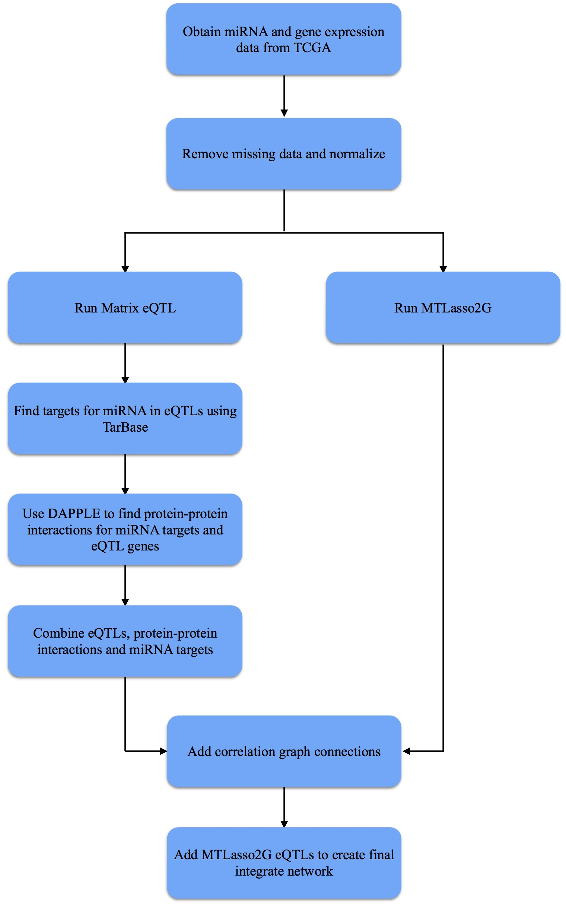
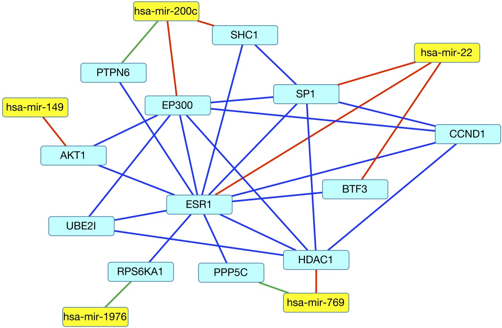

class: center, middle

# An Integrated Network in Ovarian Cancer

Andrew Quitadamo

---

#Overview

* We created an integrated gene and miRNA network in ovarian cancer

--

* We created an initial network using miRNA eQTLs, and expanded it using miRNA targets and protein-protein interactions

--

* Extends earlier work in miRNA eQTLs
---

#Ovarian Cancer

* Ovarian cancer is responsible for ~5% of cancer deaths in women  

--

* There will be an estimated 21,980 new cases and 14,270 deaths from ovarian cancer in 2014. 

--

* The 5 year survival is ~44%, but when ovarian cancer is diagnosed in the first stage the 5 year survival is over 90%.

---

#micro RNAs

* miRNAs are small non-coding RNAs

--

* miRNAs regulate mRNA expression by degrading transcripts or blocking translation

--

* Changes in miRNA expression have been implicated in many cancer types, including ovarian cancer

---

#eQTL Analysis

* Expression quantitative trait loci analysis measures how gene expression is affected by genetic loci.

--

* In this case we looked at miRNA expression effection mRNA expression

--

* We used Matrix eQTL, an R package, to perform the analysis

---

# Thinking with Networks

* Our approach combines three different types of biological networks: miRNA-gene targets, protein-protein interactions, and gene correlation networks

--

* Each network incorporates information about different biological mechanisms

--

* By combining the networks to create an integrate network, we hope to generate a more inclusive view of the biology of ovarian cancer

---
# Workflow

---

# Results

* 44 miRNA eQTLs, containing 16 unique miRNAs and 44 unique genes

--

* 310 miRNA targets from TarBase, 244 could be used as DAPPLE inputs

--

* 145 direct connections from DAPPLE containing a seed gene with a corrected p-value of < 0.05 
 
--

* From MtLasso2G we added 9 miRNA correlations and 18 gene correlations

--

* Added 8 eQTLs from MtLasso2G

--

* Final network has 167 nodes and 277 edges

---

#Final Network

---

#Subnetwork

---

# Cancer Genes and miRNA

* In the integrated network there were 26 cancer associated genes, 11 of which were associated with ovarian cancer

--

* There were 14 cancer associated miRNAs, 12 related to ovarian cancer

---

# Future Work

* Add more networks such as gene regulatory networks

--

* Look at up and down regulatory effects in the network
